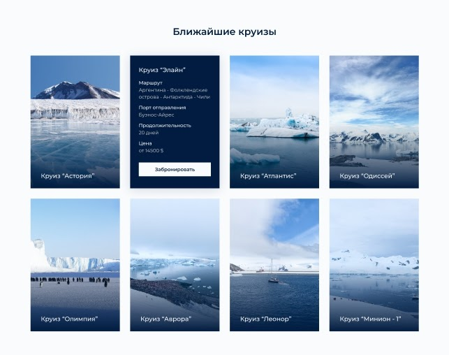
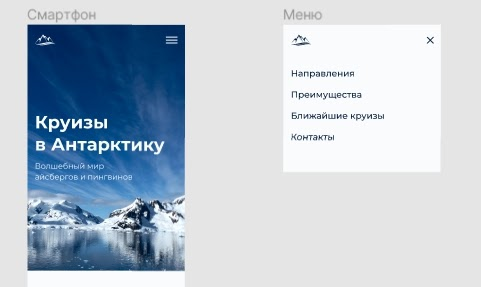

# Техническое задание Антарктика

Проект должен соответствовать критериям качества.  
При конфликте технического задания и критериев, считать техническое задание более приоритетным.  

## Общие технические требования

1. Стандарты вёрстки: HTML5, CSS3, прогрессивное улучшение.
2. Сетка: определена в макете.
3. Раскладка блоков на странице делается с помощью флексбоксов.
4. Адаптивность сетки: мобильная, планшетная и десктопная версии. **Desktop First.** На всех промежуточных разрешениях используется резиновая вёрстка.
5. Используемая методология: БЭМ.
6. Используемые фреймворки: нет.
7. Используемый препроцессор: Sass (SCSS).
8. Используемый инструмент автоматизации: Gulp.
9. Кроссбраузерность: Chrome, Firefox, Safari, Edge, Internet Explorer 11.
10. Графика не предоставляется и её необходимо вырезать самостоятельно.
11. Нестандартные шрифты подключены локально.
12. JavaScript: минимальная реализация, модальные окна, переключения и так далее.

## Пояснения по макету

1. Необходимо выполнить верстку одной страницы с адаптивностью. Десктопная, планшетная и мобильная версии.
2. Брейкпоинты :
    - мобильная версия — 320px - 767px;
    - планшетная версия — 768px - 1023px;
    - десктопная версия — от 1024px и выше
3. При наведение на карточку круиза появляется информация о нем и кнопка Забронировать - ведет на страницу, которой нет в макете.

4. Главное меню в мобильной и планшетной версии реализуется с применение JavaScript.Меню должны быть работоспособным при отключенном JavaScript.  

  В HTML- и CSS-коде должны быть предусмотрены элементы и правила для трёх возможных состояний:
    - Открытое меню потоке при отключённом JavaScript;
    - Открытое меню вне потока при включённом JavaScript;
    - Закрытое меню.

  Скрипт открытия и закрытия меню должен работать так:
    - При инициализации скрипта меню должно убираться из потока (если в макете открытое меню не в потоке) и закрываться;
    - При клике на гамбургер меню открывается. Появляется кнопка-закрытие, убирается кнопка-гамбургер;
    - При клике на закрытие меню закрывается, убирается кнопка-закрытие, появляется гамбургер.

## Информация по круизам

**Круиз "Астория"**

- Аргентина - Фолклендские острова - Антарктида
- Порт(ы) отправления: Ушуайя
- Продолжительность 11 дней
- Цена от 11500 $

**Круиз “Элайн” - на макете. В качестве картинке взять любую соседнюю.** 

**Круиз "Атлантис"**

- Аргентина - Южная Георгия и Южные Сандвичевы Острова - Антарктида
- Порт(ы) отправления: Ушуайя
- Продолжительность 15 дней
- Цена от 14500 $

**Круиз "Одиссей"**

- Чили - Антарктида
- Порт(ы) отправления: Пунта-Аренас
- Продолжительность 13 дней
- Цена от 9700 $

**Круиз "Олимпия"**

- Аргентина - Фолклендские острова - Южная Георгия - Антарктида
- Порт(ы) отправления: Ушуайя
- Продолжительность 21 день
- Цена от 18600 $

**Круиз "Аврора"**

- Аргентина - Антарктида - Чили
- Порт(ы) отправления: Ушуайя
- Продолжительность 14 дней
- Цена от 11700 $

**Круиз "Леонор"**

- Чили - Южная Георгия - Антарктида - Аргентина
- Порт(ы) отправления: Пунта-Аренас
- Продолжительность 17 дней
- Цена от 12500 $

**Круиз "Минион - 1"**

- Аргентина - Антарктида
- Порт(ы) отправления: Ушуайя
- Продолжительность 11 дней
- Цена от 12300 $  
